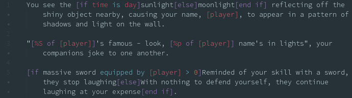

# Multi-User Forth grammar

A package that provides basic syntax highlighting for Multi-User Forth (MUF) string parsing, developed for the [Flexible Suvival MUCK](https://flexiblesurvival.com/).

## Installation

Either `apm install language-muf`, or use Atom's package installer UI via Edit->Preferences->Install, and search for language-muf.

## Limitations

*   Only an initial implementation, so may be missing elements.
*   Only provides highlighting for string replacement functions, other MUF elements are not covered (yet)
